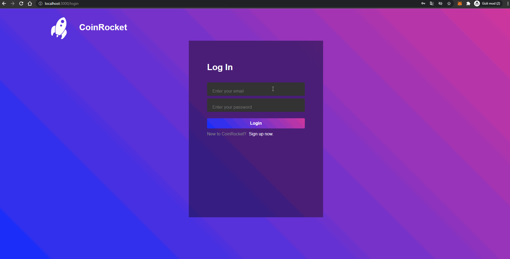

## CoinRocket

[](https://github.com/gorkemmeydan/coinrocket-interface/blob/main/.github/workflows/integration.yml)

A full-stack web application for people to track their crypto assets with history and follow the current market by prices, trending coins and news.

## Technologies used

### User Interface

React.js, Next.js, styled-components and Typescript is used for the user interface. For state management Context API is used.

### Security

For security, Oauth2 access and refresh JWT tokens are used with cookies. Authentication guards are done on the server-side with middleware and the server-side proxy server handles communication with the backend.

### Proxy Server

Next.js API routes are used for an http-proxy that routes to the backend. Hence, the client never directly communicates with the backend.

### Testing

Integration tests are done with Cypress and the proxy server is mocked with Mirage.js. The testing process is automated with Github Actions.

### Backend

Backend is written with Java, Spring Boot/Cloud, Hibernate, PostgreSQL, Redis and Docker. Backend can be seen [here](https://github.com/gorkemmeydan/coinrocket-api)

## Demo



## Setup / Installation

For running the development server:

```bash
npm run dev
# or
yarn dev
```

For building and running the application:

```bash
npm run build
# or
yarn build
```

and

```bash
npm run start
# or
yarn start
```
